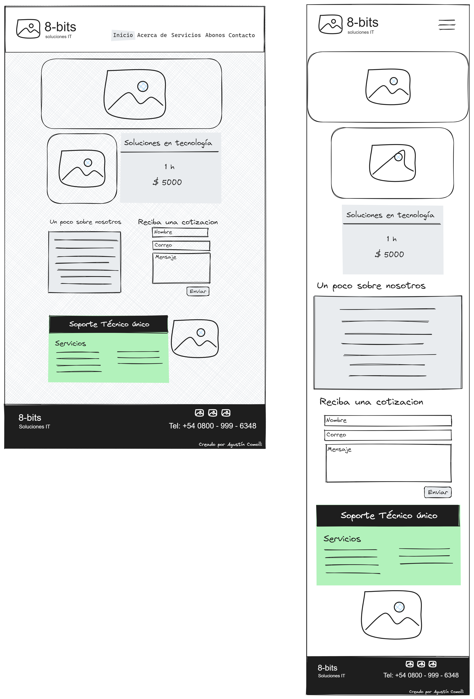
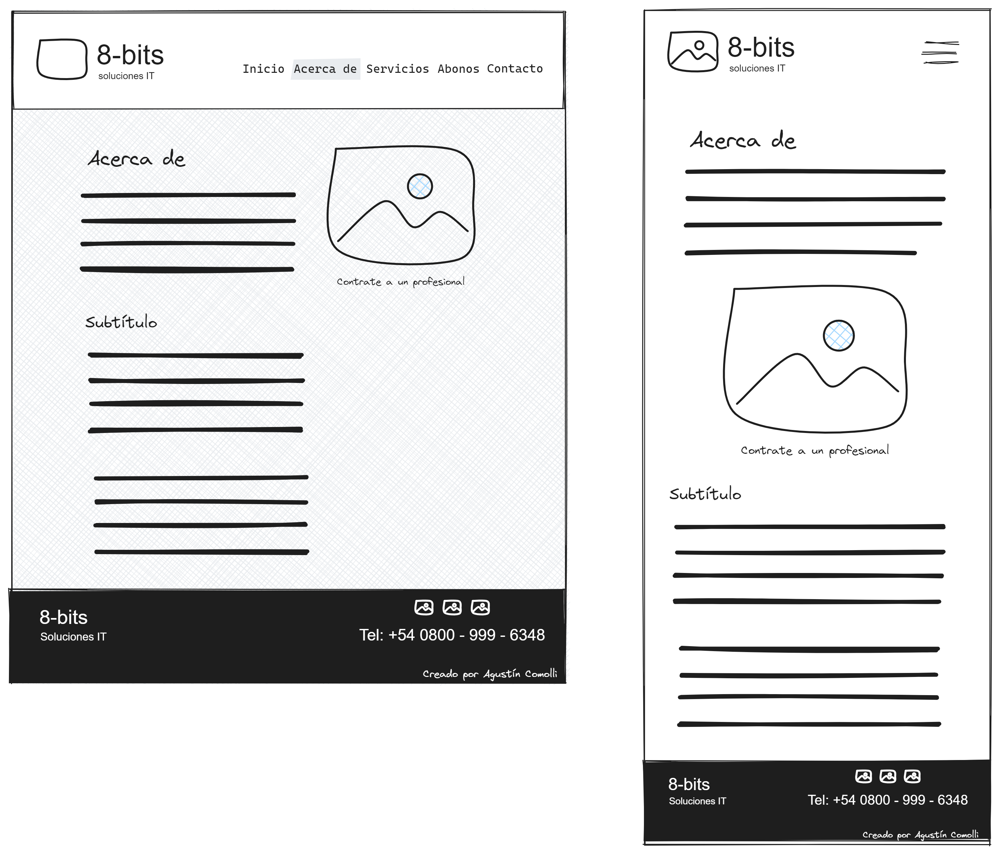
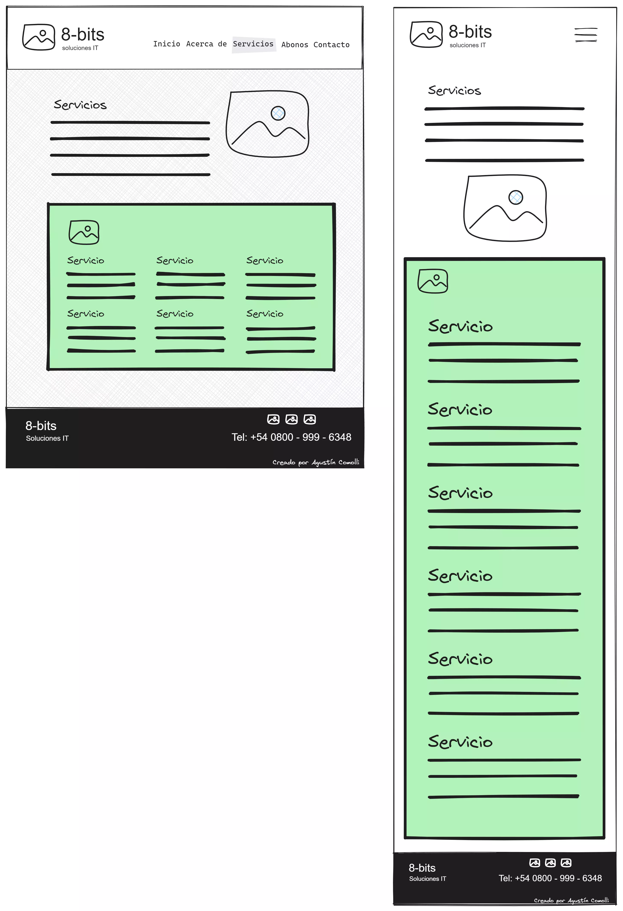
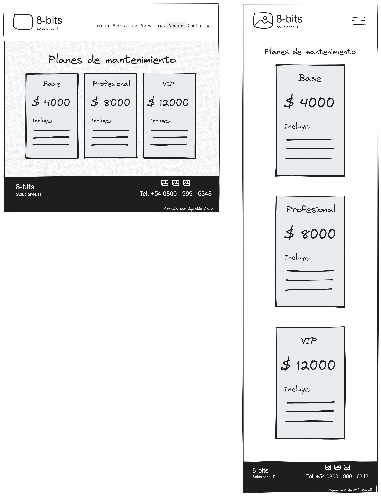
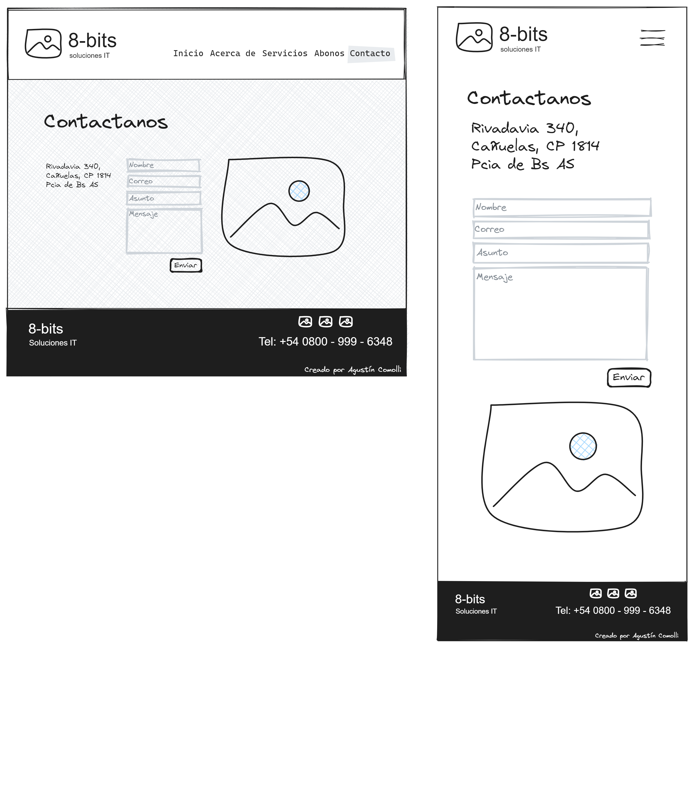
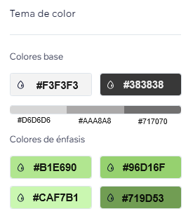
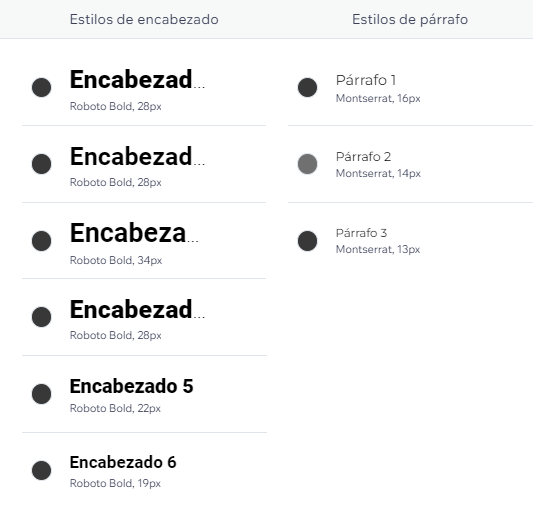

# Detalles de Diseño de 8-bits

En este archivo, vamos a profundizar en los detalles de diseño y wireframes de nuestro sitio web 8-bits.

## Wireframes

Los wireframes para las diversas páginas de nuestro sitio están a continuación. Estos proporcionan una guía visual de alto nivel para la estructura y el diseño general de cada página.

<!--  -->

☝🏻 Este es el wireframe para nuestra página principal.

<!--  -->

☝🏻 Este wireframe muestra el diseño planeado para nuestra página "Sobre nosotros".

<!--  -->

☝🏻 Aquí está el wireframe para la página "Servicios".

<!--  -->

☝🏻 Este es el wireframe para la página "Planes".

<!--  -->

☝🏻 Finalmente, este es el wireframe para nuestra página "Contacto".

## Paletas de Colores y Fuentes

También hemos seleccionado una paleta de colores y fuentes específicas para mantener un aspecto coherente en todo nuestro sitio web.

<!--  -->

☝🏻 Estos son los colores principales que usaremos a lo largo de nuestro sitio web.

<!--  -->

☝🏻 Estas son las fuentes que hemos seleccionado para nuestro sitio.

Esperamos que este archivo te de una visión más en profundidad de nuestro proceso de diseño y las elecciones estilísticas para este proyecto.

Para volver a la página principal del repositorio, haz click aquí: [Regresar al Inicio](./README.md) ↩️